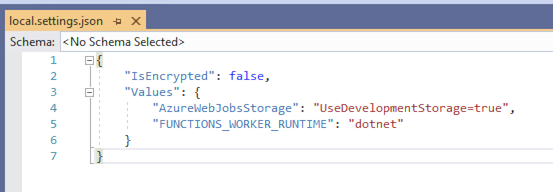

# "Pico y Placa" Predictor
To accomplish this exercise I created a .net core application with a simple FRONTEND and BACKEND architecture

In order to run the solution localy you must follow this steps:

# BACKEND
The backend is an Azure Functions microservice called PicoYPlacaService.

In order to run the microservice localy you must add a local.settings.json file (this file is not uploaded to the repository for security reasons)

Once you added the file and run the PicoYPlacaService project a url of a REST API is gonna be created, you should copy the url and do not close the project.

# FRONTEND
The front end is a simple Razor Pages web app called PicoYPlacaFront.

In order to run the web app localy you must copy the url of the Azure Functions microservice and paste it in the appsettings file in the next key:
"AzureFunctionsUrl": "AZURE_FUNCTION_URL"

Once you added the key in the appsettings file you can run the PicoYPlacaFront project

You can test the application entering the next values:

